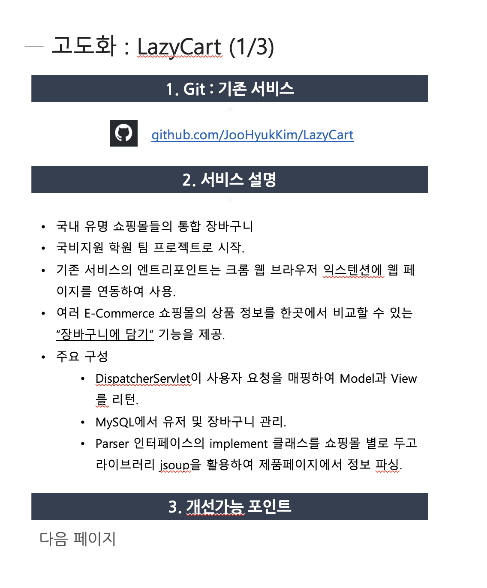
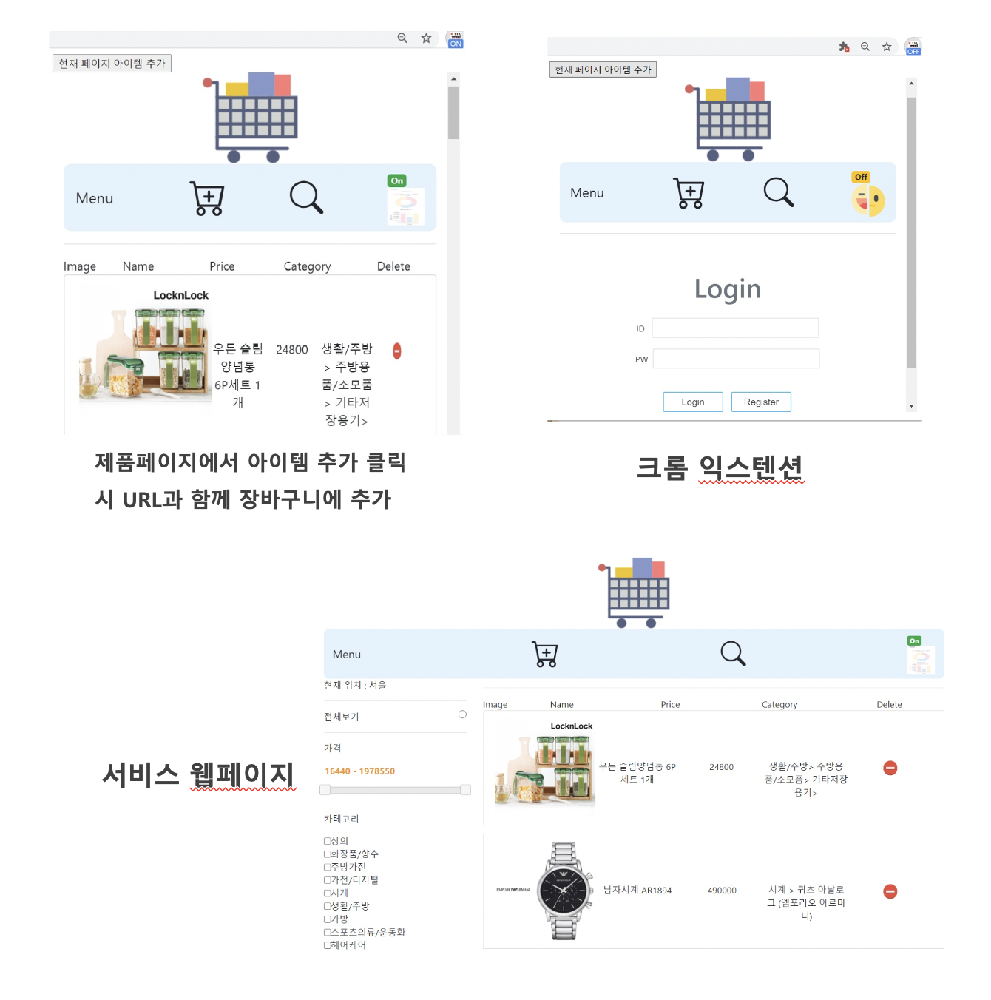
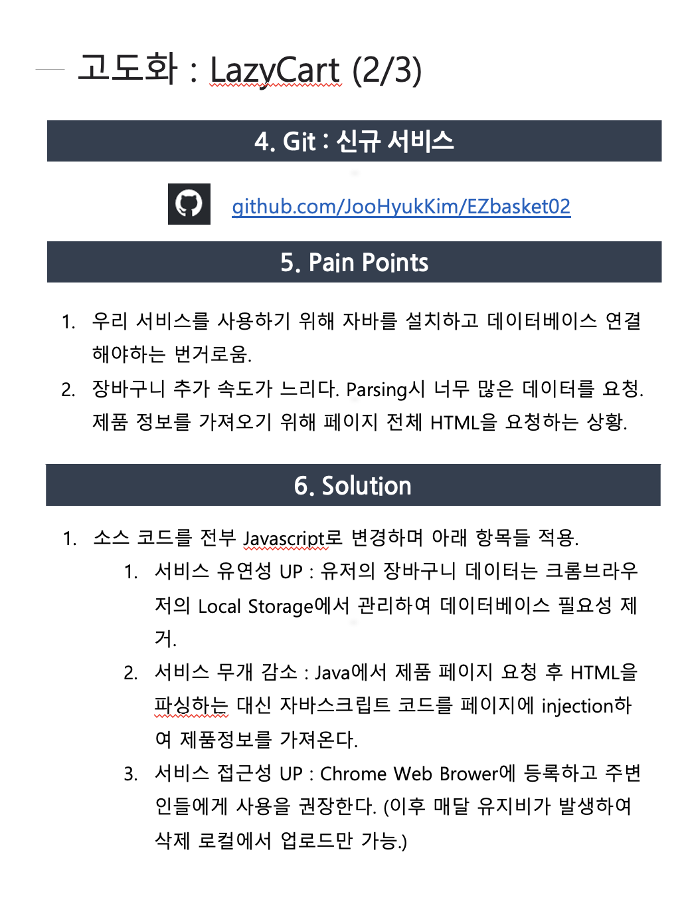
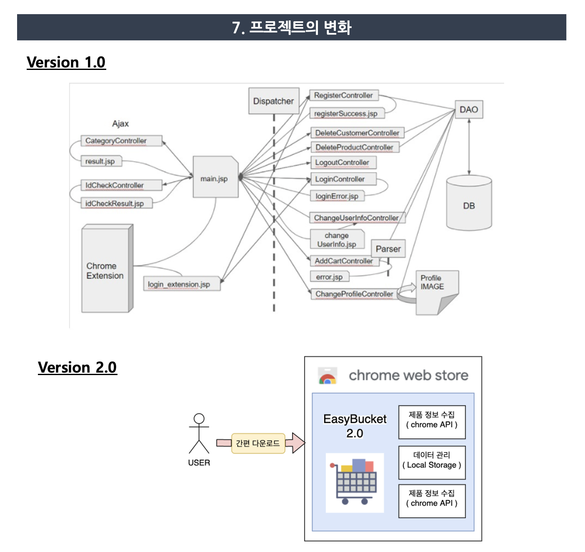
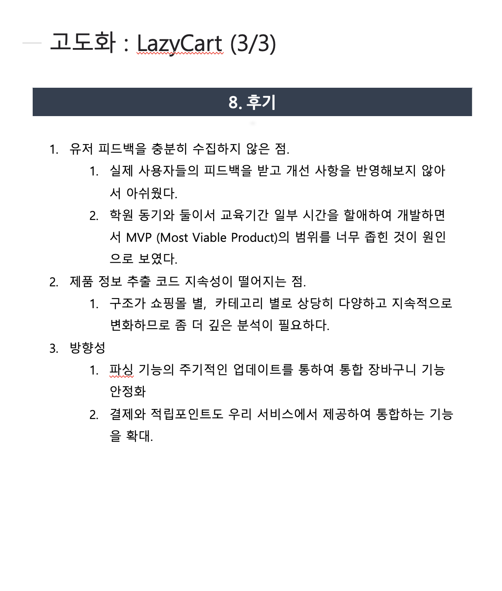
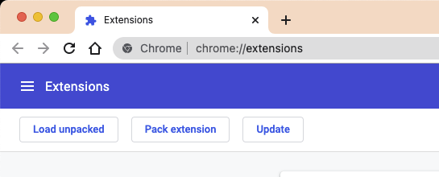
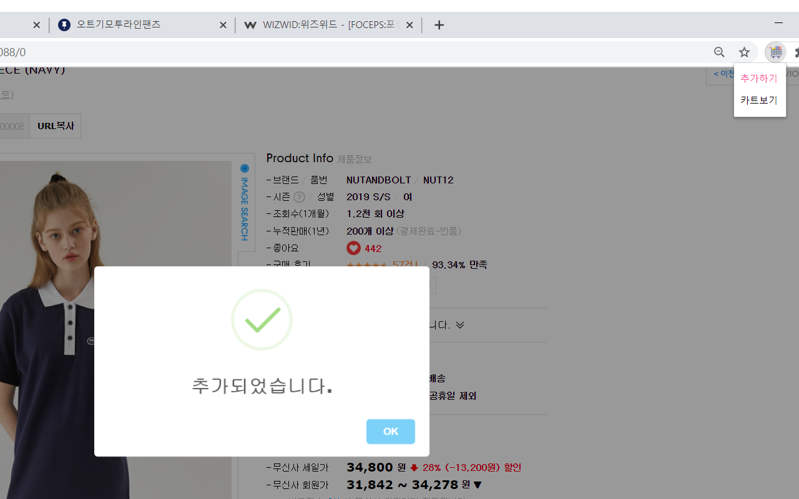

# LazyCart v2.0

## LazyCart v1.0 고도화 프로세스 정리

 
 
 
 
 

## Deployment

1. git clone 프로젝트
2. 크롬 브라우저 오픈
2. 다음 URL로 이동 chrome://extensions/
3. 상단 "Load Unpacked" Button 클릭

4. src 폴더 업로드
5. 사용시작

## Chrome Web Store 배포 버전

