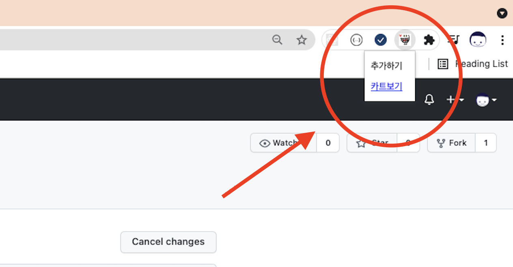

 

# LazyCart v2.0 란?
- 간편한 통합 장바구니 담기 서비스
- 사용방법
  1. 관심있는 제품 페이지 이동 후
  2. 크롬브라우저 우측 상단의 담기 버튼을 누르면 끝! 
- 지원하는 쇼핑몰
  - 네이버
  - 쿠팡
  - 지마켓
  - ssg 
  - 외 국내 유명 쇼핑몰 30여 곳의 

## architecture
- 기존 일반적인 3-tier web

## LazyCart v1.0 고도화 프로세스 정리

 
 
 
 
 

## Deployment

1. git clone 프로젝트
2. 크롬 브라우저 오픈
2. 다음 URL로 이동 chrome://extensions/
3. 상단 "Load Unpacked" Button 클릭

4. src 폴더 업로드
5. 사용시작

## Chrome Web Store 배포 버전

